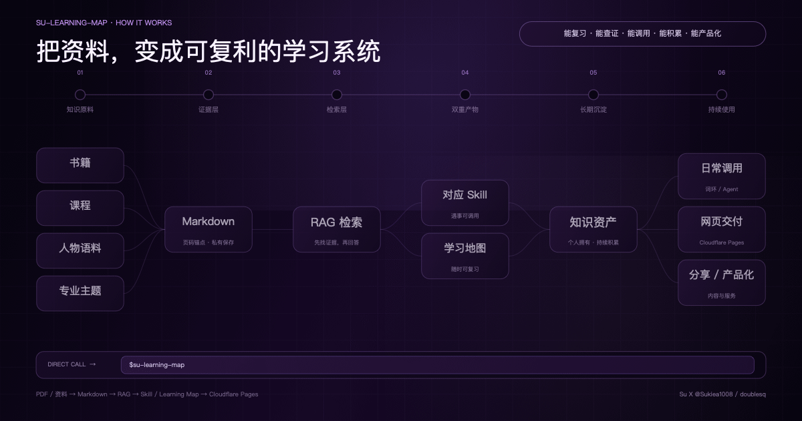

# 学习地图

把书籍、课程、人物语料或专业主题，变成一套**能复习、能查证、能调用、能积累、还能继续产品化的个人知识资产**。

它不是把资料总结得更短，而是把一次阅读变成第二天还能打开、遇到问题还能调用、重要结论还能回到来源核验的学习系统。



## 你能从这个仓库带走什么

- 一个可直接安装的 [`su-learning-map`](su-learning-map/) Skill；
- 一条完整方法：`PDF / 资料 → Markdown 证据层 → RAG → 对应 Skill → Learning Map → Cloudflare Pages`；
- 三套已跑通的赠品：**纳瓦尔、李笑来、马斯克**的在线学习地图、静态网页源码、对应 Skill 与调用方式；
- PDF 转页码 Markdown、深度卡合并、学习地图构建脚本；
- 学习内容 Schema、证据等级、质量门、响应式阅读器与 `wabi-reading` 主题；
- Cloudflare Pages 直接部署说明和脱敏台账模板。

完整书籍、付费课程全文、私人笔记、私有 RAG 语料、Cloudflare 项目信息和 Secret 不在仓库中。

## 快速安装

把下面整段复制给支持 Agent Skills 的 Agent：

```text
请帮我安装这个 GitHub 仓库里的 `su-learning-map` Skill：
https://github.com/doublesq97-ui/su-learning-map/tree/main/su-learning-map

安装完成后，请告诉我：
1. 安装到了哪里；
2. 如何快速调用；
3. 第一次使用需要准备什么材料；
4. 给我一条可以直接替换内容的最短调用示例。
```

安装后，最快这样开始：

```text
$su-learning-map
主题：[填写]
材料：[文件、目录或 URL]
交付：[完整流程 / 仅私有语料 / 仅 Skill / 仅学习地图]
联网：[需要 / 不需要 / 你判断]
Cloudflare Pages：[部署 / 暂不部署]
```

完整可复制提示词见 [`quick-invocation.md`](su-learning-map/references/quick-invocation.md)。

脚本要求 Python 3.10+。PDF 转换脚本额外需要 `pypdf`；如果系统已安装 `pdftotext`，正文提取会优先使用它：

```bash
python3 -m pip install pypdf
```

注意：扫描版 PDF 还需要先做 OCR；当前脚本不会替你识别图片里的文字。

## 三套成品赠品

这不是三张演示截图，而是三套可以打开、下载和调用的真实成品：

| 成品 | 在线学习地图 | Skill | 主要适用方向 |
|---|---|---|---|
| 纳瓦尔 | [立即打开](https://naval-learning-map.pages.dev/) | [`naval-perspective`](gifts/naval/skill/naval-perspective/) | 职业与项目、特定知识、杠杆、所有权、长期复利、欲望与幸福 |
| 李笑来 | [立即打开](https://li-xiaolai-learning-map.pages.dev/) | [`li-xiaolai-perspective`](gifts/li-xiaolai/skill/li-xiaolai-perspective/) | 概念重定义、注意力、个人商业模式、成长学习、决策与写作 |
| 马斯克 | [立即打开](https://elon-learning-map.pages.dev/) | [`elon-musk-perspective`](gifts/elon-musk/skill/elon-musk-perspective/) | 第一性原理、极限、瓶颈、制造、项目执行与未来技术 |

每套赠品还包含可离线运行的静态学习地图源码和最短调用示例，统一入口见 [`gifts/README.md`](gifts/README.md)。


## 为什么需要整条生产线

普通摘要解决的是“我现在快速知道它讲了什么”。但真实使用中，人们更常卡在下面这些地方：

- 摘要生成后再也没打开；
- AI 回答看起来合理，却不知道来自原文还是模型推断；
- 真遇到职业、项目或学习问题时，想不起读过的概念；
- PDF、笔记、Prompt、网页散落各处，过几个月连自己都找不到；
- 想分享或做成产品时，又要从原材料重新整理一遍。

这套 Workflow 把它们拆成稳定的工程层：

```text
PDF / 资料
→ 带来源定位的 Markdown 证据层
→ RAG 检索
→ 对应 Skill
→ Learning Map
→ 可选 Cloudflare Pages 部署
```

翻译成使用者语言，就是：**找得回、查得到、问得动、每天能学、手机能打开，并且以后还能继续做内容或产品。**

## 核心架构

| 层 | 真源 | 负责什么 |
|---|---|---|
| 原料 | PDF、课程、文章、访谈、主题资料 | 决定系统究竟知道什么 |
| 证据 | 来源清单与带锚点 Markdown | 检索、定位、核验、公开边界 |
| 调用 | 主题或人物 Skill | 何时触发、怎样判断、何时拒绝 |
| 学习 | 内容 JSON | 学习路径、概念卡、来源、练习、连接 |
| 体验 | 主题包与阅读器 | 搜索、进度、笔记、桌面和手机阅读 |
| 交付 | 静态输出目录与部署记录 | 本地使用、分享、部署、验证与台账 |

这些层不能混成一个大提示词。页面可以缩短内容，但不能改变证据；Skill 可以调用框架，但不能把推断伪装成原话；公开网页可以展示摘要和短引文，但不能带出完整私有语料。

## 与女娲、普通蒸馏 Skill 的关系

人物蒸馏工具解决的是“怎样把一个人的公开材料提炼成可调用 Skill”。当输入是一位公众人物时，`su-learning-map` 可以调用这类专业能力；之后继续完成证据层、学习层、体验层和交付层。

所以两者不是互相替代：人物蒸馏是专业工位，`su-learning-map` 是从原料到学习产品的完整生产线。输入也不只限于人物，还可以是书、课程、论文集合或专业主题。

## Cloudflare Pages：个人静态地图通常够用

截至 2026-08-12，Cloudflare 官方文档说明：静态资源请求在免费和付费计划中都免费且不限量；免费计划包含每月 500 次构建、单站最多 20,000 个文件、单个静态文件最多 25 MiB，并允许每个账户最多 100 个 Pages 项目。Pages Functions 会计入 Workers 配额，免费计划目前是 Workers 与 Pages Functions 合计每天 100,000 次请求。

对只有 HTML、CSS、JavaScript 与数据文件的个人学习地图，这些额度通常足够。Direct Upload 不要求公开 GitHub 仓库，也不要求先购买域名：

```bash
npx wrangler login
npx wrangler pages project create
npx wrangler pages deploy <OUTPUT_DIRECTORY>
```

上线前请重新核对官方文档：[Pages Limits](https://developers.cloudflare.com/pages/platform/limits/)、[Functions Pricing](https://developers.cloudflare.com/pages/functions/pricing/) 与 [Direct Upload](https://developers.cloudflare.com/pages/get-started/direct-upload/)。

`*.pages.dev` 是公开地址，不是有密码的私人空间。完整书籍、付费原文、私人笔记、环境变量和凭据不得进入公开目录。

## 仓库结构

```text
su-learning-map/
├── README.md
├── LICENSE
├── assets/                       # GIF、MP4、海报与图谱规格
├── gifts/                        # 三套成品：地图源码、Skill、调用方式
└── su-learning-map/
    ├── SKILL.md
    ├── agents/
    ├── references/
    ├── scripts/
    └── assets/
```

## 公开与私有边界

- 完整 PDF、付费课程全文与私有笔记默认留在本地；
- 公开地图只使用摘要、必要的短引用、来源定位和官方链接；
- 人物 Skill 默认是框架顾问，不冒充本人、不伪造原话；
- 涉及当前公司、产品、市场、政策、人物或投资事实时重新联网核验；
- 部署前扫描公开目录，确认没有本机路径、私有语料、凭据与环境文件；
- 台账只记录 Secret 名称和是否配置，绝不记录值。

## License

本 Workflow、脚本、模板和原创 Skill 以 [MIT License](LICENSE) 开源。原始书籍、第三方资料、人物姓名与外部链接仍归各自权利人所有。
